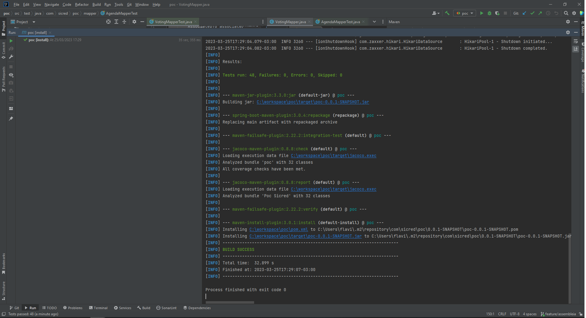

# poc

### Desafio Técnico Objetivo

No cooperativismo, cada associado possui um voto e as decisões são tomadas em assembleias, por votação.
A partir disso, você precisa criar uma solução back-end para gerenciar essas sessões de votação.
Essa solução deve ser executada na nuvem e promover as seguintes funcionalidades através de uma API
REST:

* Cadastrar uma nova pauta;
* Abrir uma sessão de votação em uma pauta (a sessão de votação deve ficar aberta por um tempo
determinado na chamada de abertura ou 1 minuto por default);
* Receber votos dos associados em pautas (os votos são apenas **'sim'/'nao'**. Cada associado é
identificado por um id único e pode votar apenas uma vez por pauta);
* Contabilizar os votos e dar o resultado da votação na pauta;

Para fins de exercício, a segurança das interfaces pode ser abstraída e qualquer chamada para as interfaces
pode ser considerada como autorizada. A escolha da linguagem, frameworks e bibliotecas é livre (desde que
não infrinja direitos de uso).

É importante que as pautas e os votos sejam persistidos e que não sejam perdidos com o restart da aplicação.


### Health
* [Health Check](http://localhost:8080/poc/v1/actuator)
* [Health Check Custom](http://localhost:8080/poc/v1/actuator/health/custom)
* 
[Documentação da API (Swagger)](http://localhost:8080/poc/v1/swagger-ui/index.html#/)
Possível o acesso ao console H2

[Login H2 Console Data Base](http://localhost:8080/poc/v1/h2-console/)


## TESTES

### Unitários

Execute a linha de comando:

```sh
mvn clean test
```

Execute a linha de comando para gerar relátório do jacoco:

```sh
mvn clean install
```
Evidencias:


### Documentação de referência
Para referência adicional, considere as seguintes seções:

* [Documentação oficial do Apache Maven](https://maven.apache.org/guides/index.html)
* [Guia de Referência do Plug-in Spring Boot Maven](https://docs.spring.io/spring-boot/docs/3.0.4/maven-plugin/reference/html/)
* [Criar uma imagem OCI](https://docs.spring.io/spring-boot/docs/3.0.4/maven-plugin/reference/html/#build-image)
* [Spring Boot DevTools](https://docs.spring.io/spring-boot/docs/3.0.4/reference/htmlsingle/#using.devtools)
* [Spring Reactive Web](https://docs.spring.io/spring-boot/docs/3.0.4/reference/htmlsingle/#web.reactive)
* [Spring Data JPA](https://docs.spring.io/spring-boot/docs/3.0.4/reference/htmlsingle/#data.sql.jpa-and-spring-data)
* [Access the Same In-Memory H2 Database in Multiple Spring Boot Applications](https://www.baeldung.com/spring-boot-access-h2-database-multiple-apps)
* [Spring Boot With H2 Database](https://www.baeldung.com/spring-boot-h2-database)
* [Hibernate @NotNull vs @Column(nullable = false)](https://www.baeldung.com/hibernate-notnull-vs-nullable)
* [Quick Guide to Hibernate enable_lazy_load_no_trans Property](https://www.baeldung.com/hibernate-lazy-loading-workaround)
* [Where Does H2’s Embedded Database Store The Data?](https://www.baeldung.com/h2-embedded-db-data-storage)
